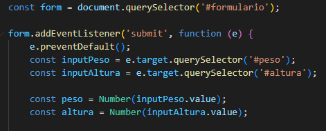
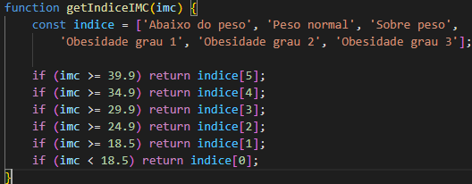
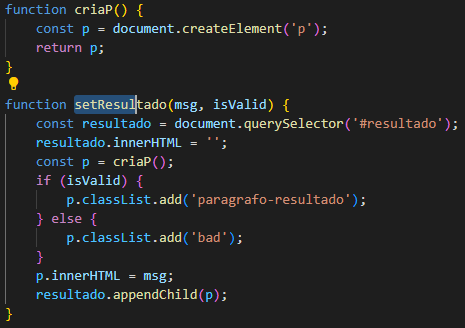

<h1>Calculadora IMC</h1>

<h2><li>Sobre o código</li></h2>

O código começa selecionando o formulário HTML com a ID 'formulario' e adicionando um evento de envio (submit) a ele. Esse evento é ativado quando o formulário é submetido. O primeiro comando dentro do evento é impedir o comportamento padrão do envio do formulário, usando a função . Em seguida, ele seleciona os campos de entrada de peso e altura, e extrai seus valores como números. e.preventDefault(). 

Se o valor do peso for falso (undefined, null, zero, ou uma string vazia), a função é chamada com uma mensagem de erro, e o código retorna. O mesmo ocorre se o valor da altura for falso. 

Se ambos os valores de peso e altura forem verdadeiros, o código calcula o IMC usando a função e determina a categoria do IMC usando a função "setResultado" "getImcget" "IndiceIMC"

A função recebe o peso e altura e calcula o IMC dividindo o peso pela altura ao quadrado. O resultado é arredondado para duas casas decimais usando o método .getImctoFixed()

A função recebe o valor do IMC e retorna uma string com a categoria correspondente. As categorias são definidas em um array, e cada categoria é selecionada de acordo com o valor do IMC.

A função cria um elemento HTML e a função recebe uma mensagem e um valor booleano, seleciona o elemento HTML com a ID 'resultado', o esvazia, cria um novo elemento , adiciona uma classe CSS dependendo do valor booleano, insere a mensagem nesse elemento e adiciona o elemento como filho do elemento 'resultado'.

